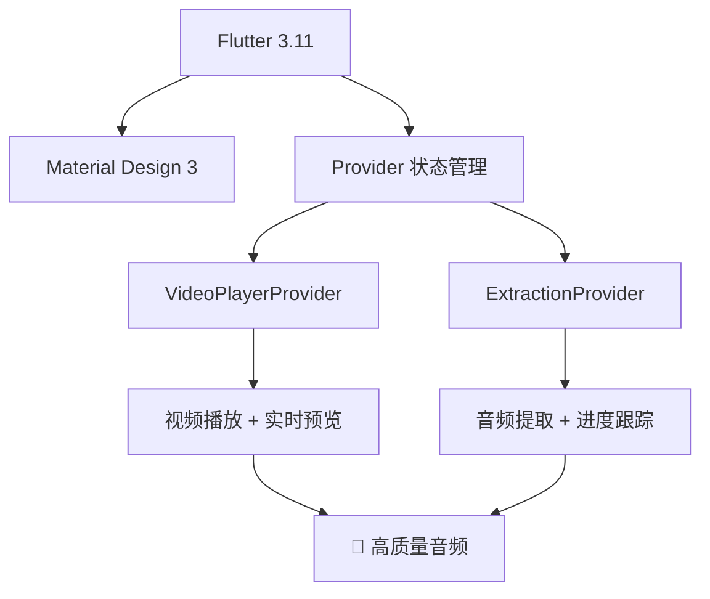

# 🎵 从视频中提取音频，这款开源工具让你秒变音频处理大师！

> 告别繁琐的命令行操作，一款优雅的 macOS 音频提取工具让工作效率提升 10 倍

---

## 💫 开篇：为什么需要音频提取？

你是否遇到过这样的场景：

- 🎬 **视频学习**：在线课程视频太大，只想提取音频在通勤时听
- 🎵 **音乐收藏**：MV 太占空间，只想要音频文件
- 📻 **播客制作**：需要从视频素材中提取高质量音轨
- 🎙️ **语音转写**：提取音频用于语音识别或字幕制作

传统的方法要么使用**在线转换工具**（上传下载慢、有广告、文件大小限制），要么使用**命令行 FFmpeg**（需要技术背景、操作繁琐）。

**直到我发现了这款宝藏工具 —— AudioExtractor** ✨

---

## 🚀 AudioExtractor：重新定义音频提取

### 🎯 核心亮点

<div align="center">

```
┌─────────────────────────────────────────────┐
│                                             │
│         ✨ 一键提取，优雅高效 ✨            │
│                                             │
│  🎬 视频预览  +  🎯 精确选择  +  🚀 极速提取  │
│                                             │
└─────────────────────────────────────────────┘
```

</div>

#### 1️⃣ **所见即所得的视频预览**

**📸 [截图：主界面 - 视频播放器 + 双滑块进度条]**

- 内置视频播放器，直接预览视频内容
- **双滑块时间轴**：拖拽选择提取范围
- 实时预览选中片段，精确到毫秒
- 支持单帧前进/后退，完美定位起点终点

> 💡 **痛点解决**：再也不用打开播放器记时间点，再手动输入秒数了！

#### 2️⃣ **毫秒级精度控制**

**📸 [截图：双滑块拖动特写 + 时间显示]**

- **短视频**：毫秒级精度（< 10分钟）
- **长视频**：秒级精度（≥ 10分钟）
- 支持手动输入时间：`HH:MM:SS.mmm`
- 拖动时实时低分辨率预览，流畅丝滑

> 💡 **痛点解决**：精确剪切音乐开头杂音、提取精彩片段，毫秒不差！

#### 3️⃣ **零配置开箱即用**

**📸 [截图：拖拽视频文件到应用窗口]**

```bash
# 不需要这样：
brew install ffmpeg
ffmpeg -i video.mp4 -ss 00:01:23 -to 00:05:67 ...
# ❌ 太复杂！

# 只需要这样：
# 拖拽视频 → 选择范围 → 点击提取
# ✅ 三步搞定！
```

- **内置 FFmpeg**：99MB 独立应用，无需安装任何依赖
- **拖拽加载**：直接拖拽视频文件到窗口
- **智能识别**：自动检测所有音轨信息
- **完美支持中文**：文件名、路径、特殊字符全支持

> 💡 **痛点解决**：妈妈再也不用担心我不会配置 FFmpeg 了！

#### 4️⃣ **完整的快捷键系统**

**📸 [截图：快捷键说明面板]**

| 快捷键 | 功能 | 使用场景 |
|--------|------|----------|
| `空格` | 播放/暂停 | 快速预览 |
| `←` `→` | 快退/快进 5秒 | 粗略定位 |
| `Shift + ←` `→` | 单帧后退/前进 | **精确到帧** |
| `R` | 从头播放 | 重新预览 |

> 💡 **痛点解决**：键盘党狂喜，鼠标都不用碰！

---

## 🎬 实战演示：3 分钟提取音频

### 场景：从 TED 演讲视频提取音频

**📸 [截图：完整操作流程 - 分步展示]**

#### Step 1: 加载视频（5 秒）
```
拖拽 TED_Talk.mp4 到应用窗口
↓
自动加载视频，显示总时长 18:32
```

#### Step 2: 预览并选择范围（1 分钟）
```
播放视频 → 找到精彩片段
↓
拖动左滑块到 02:15.000
拖动右滑块到 05:30.500
```

#### Step 3: 配置输出（10 秒）
```
选择质量：高质量（保持原质量）
选择音轨：Audio - English (AAC)
设置输出：~/Downloads/TED_Audio/
```

#### Step 4: 开始提取（等待完成）
```
点击"开始提取"按钮
↓
进度条显示：██████████ 100%
↓
自动打开输出目录
```

**📸 [截图：提取完成 - 输出目录显示音频文件]**

```bash
输出文件：
TED_Talk_02m15s_05m30s.m4a
大小：8.2 MB
时长：03:15
质量：完美 ✅
```

---

## 🔥 技术亮点：不只是颜值高

### 🏗️ 现代化的技术栈

<div align="center">



</div>

#### 为什么选择 Flutter？

- ✅ **跨平台**：一套代码，未来支持 Windows/Linux
- ✅ **原生性能**：编译为原生代码，流畅丝滑
- ✅ **现代化 UI**：Material Design 3，动画精美
- ✅ **活跃生态**：丰富的插件和工具

#### 内置 FFmpeg 的权衡

**📸 [截图：应用大小对比]**

| 方案 | 应用大小 | 依赖 | 便携性 |
|------|----------|------|--------|
| 外部 FFmpeg | ~10 MB | ❌ 需要 brew install | ❌ 差 |
| **内置 FFmpeg** | **~99 MB** | **✅ 零依赖** | **✅ 完美** |

> 💡 **设计决策**：用 90MB 换取零配置的开箱即用体验，值得！

#### 精心设计的架构

```
UI Layer (Widgets)
    ↓
Business Logic (Providers)
    ↓
Service Layer (FFmpeg Kit)
    ↓
Data Layer (Models)
```

- **分层架构**：清晰的职责划分
- **状态管理**：Provider 模式，响应式更新
- **错误处理**：详细的错误提示和解决建议
- **日志系统**：完整的调试信息输出

---

## 💻 使用技巧：让你的效率翻倍

### 🎯 技巧 1：精确选择音乐开头

**问题**：MP3 文件开头有 0.5 秒杂音

**解决方案**：
1. 拖动视频到应用
2. 播放到音乐真正开始的地方
3. 按 `Shift + ←` 单帧后退到精确位置
4. 拖动左滑块到该位置
5. 提取音频，完美去除杂音 ✅

### 🎯 技巧 2：批量提取课程音频

**场景**：有一系列教学视频，想全部提取成音频

**工作流**：
1. 创建输出目录：`~/Course_Audio/`
2. 依次加载每个视频
3. 选择完整时间范围（或手动调整）
4. 统一设置输出目录
5. 依次提取，文件自动命名：
   - `Lesson_01_00m00s_45m20s.m4a`
   - `Lesson_02_00m00s_52m15s.m4a`
   - ...

### 🎯 技巧 3：提取多语言音轨

**📸 [截图：音轨选择界面]**

- 自动检测视频中的所有音轨
- 支持选择：
  - 🇬🇧 English (AAC Stereo)
  - 🇨🇳 中文 (AAC Stereo)
  - 🎵 Background Music
- 一次提取，保留所有音轨

### 🎯 技巧 4：自定义高质量输出

**高级设置面板**：
```
基础质量：高质量（256kbps）
自定义参数：-b:a 320k -ar 48000
结果：更高码率，更高采样率 🎧
```

---

## 🌟 用户反馈：真实使用场景

### 🎓 场景 1：在线课程音频化

> "我在 Coursera 上买了课程，视频文件 20GB，但只想在通勤时听。
> 用 AudioExtractor 把 12 个视频提取成音频，总共不到 2GB，
> 音质完美，每天地铁上学习，效率翻倍！"
>
> —— 张同学，研究生

### 🎵 场景 2：音乐 MV 音频提取

> "发现了一个超棒的现场 MV，但只想要音频版本。
> 网上的音频版本音质被压缩了，用这个工具直接从 1080p 视频提取，
> 得到无损音质的现场录音，太赞了！"
>
> —— 李音乐，音乐爱好者

### 🎙️ 场景 3：播客制作

> "我做一些视频解说，需要从原始视频素材提取音轨进行后期编辑。
> 这个工具的精确选择功能太重要了，可以精确到帧，
> 再也不用反复调整时间点了好吗！"
>
> —— 王主播，播客制作人

---

## 🛠️ 开发故事：为什么做这个工具？

### 起源：个人需求

2024 年，我需要从大量教学视频中提取音频，用于通勤时学习。尝试了各种方案：

- ❌ **在线工具**：上传下载慢，还有广告
- ❌ **FFmpeg 命令行**：需要记参数，太繁琐
- ❌ **市面软件**：要么收费，要么功能受限

**于是决定自己做一个** 💪

### 技术选型：为什么是 Flutter？

1. **跨平台潜力**：虽然现在只支持 macOS，但架构支持未来扩展到 Windows/Linux
2. **现代化 UI**：Flutter 的 Material Design 3 太好看了
3. **原生性能**：编译为原生代码，启动快、运行流畅
4. **丰富的生态**：FFmpeg、视频播放、拖拽功能都有成熟的插件

### 开发历程

<div align="center">

```
2024-12  项目启动
    ↓
2025-01  第一个可用版本
    ↓
2025-02  添加视频预览和双滑块
    ↓
2025-03  v2.5 重大更新
    ├─ 内置 FFmpeg（零配置）
    ├─ 实时预览
    ├─ 毫秒级精度
    └─ 完整快捷键
    ↓
2026-03  开源发布 🎉
```

</div>

### 最大的挑战：FFmpeg 集成

**问题**：最初使用外部 FFmpeg，用户双击运行时崩溃

**原因**：macOS 应用双击启动时 `$PATH` 环境变量不同，找不到 FFmpeg

**解决方案**：
- 从外部依赖迁移到 `ffmpeg_kit_flutter_new`
- 将 FFmpeg 完整编译到应用中（90MB）
- 实现真正的**零配置、开箱即用**

**技术细节**详见：[TECHNICAL_NOTES.md](https://github.com/binlly/AudioExtractor/blob/main/TECHNICAL_NOTES.md)

---

## 🎁 开源回馈：为什么要免费？

### 💡 开源理念

> "最好的工具应该被更多人使用"

- **学习资源**：代码完整开源，可以学习 Flutter + FFmpeg 集成
- **社区贡献**：欢迎大家一起改进功能、修复 Bug
- **透明度**：所有技术细节公开，没有黑盒
- **跨平台**：未来支持 Windows/Linux 需要社区帮助

### 🤝 如何参与贡献？

<div align="center">


</div>

**贡献方式**：
- 🐛 报告 Bug
- ✨ 提出新功能建议
- 📝 改进文档
- 💻 提交代码
- 🌍 帮助翻译
- 📢 分享给朋友

---

## 📥 立即体验

### 🚀 快速开始

<div align="center">

**👉 [GitHub 仓库](https://github.com/binlly/AudioExtractor) 👈**

</div>

#### 方式一：下载安装包（推荐）

1. 前往 [Releases](https://github.com/binlly/AudioExtractor/releases) 页面
2. 下载 `AudioExtractor-v2.5.1-macos.dmg`
3. 双击安装，拖拽到 Applications

#### 方式二：从源码构建

```bash
# 克隆仓库
git clone https://github.com/binlly/AudioExtractor.git
cd AudioExtractor

# 安装依赖
flutter pub get

# 运行
flutter run -d macos

# 构建
flutter build macos --release
```

### 📋 系统要求

- ✅ macOS 11.0+ (Big Sur 或更高)
- ✅ Intel 或 Apple Silicon (M1/M2/M3)
- ✅ 至少 100MB 磁盘空间

### 🔮 未来计划

- [ ] **Windows 支持**（需要帮助！）
- [ ] **Linux 支持**（需要帮助！）
- [ ] **批量处理**（一次处理多个视频）
- [ ] **更多格式**（FLAC、OGG、WAV）
- [ ] **音频编辑**（剪切、合并、混音）

---

## 📸 截图欣赏

### 主界面

**📸 [截图：应用主界面 - 完整布局]**

- 左侧：视频播放器
- 右侧：控制面板
- 底部：时间轴和进度条

### 视频预览

**📸 [截图：视频播放中 + 双滑块选择范围]**

- 实时视频播放
- 双滑块拖动
- 时间范围显示
- 播放控制按钮

### 提取进度

**📸 [截图：提取进行中 - 进度条和剩余时间]**

- 实时进度百分比
- 预计剩余时间
- 当前处理的文件信息
- 可以取消操作

### 设置面板

**📸 [截图：高级设置面板展开]**

- 质量预设选择
- 音轨选择
- 自定义 FFmpeg 参数
- 输出目录设置

### 快捷键

**📸 [截图：快捷键帮助面板]**

- 所有快捷键列表
- 功能说明
- 使用场景提示

---

## 🎯 总结：为什么要试试 AudioExtractor？

### ✅ 适合谁？

| 用户类型 | 是否适合 | 原因 |
|----------|----------|------|
| 👨‍🎓 学生 | ✅ | 提取课程音频，通勤学习 |
| 🎵 音乐爱好者 | ✅ | 从 MV 提取高质量音频 |
| 🎙️ 播客制作人 | ✅ | 精确剪切素材 |
| 👨‍💻 程序员 | ✅ | 开源、可定制、学习代码 |
| 👨‍👩‍👧 普通用户 | ✅ | 界面简单，零配置使用 |

### ✨ 核心优势

1. 🎬 **视频预览** - 所见即所得
2. 🎯 **精确控制** - 毫秒级精度
3. 🚀 **零配置** - 开箱即用
4. 🎨 **优雅界面** - 现代化设计
5. ⌨️ **快捷键** - 键盘党友好
6. 🆓 **完全免费** - 开源软件
7. 🌍 **跨平台**：未来支持更多平台

### 🎁 最终价值

> **用最少的时间，完成最高质量的音频提取**
>
> 节省时间 = 创造价值 💰

---

## 📢 行动号召

<div align="center">

### 🌟 如果这个工具对你有帮助

- ⭐ **Star** GitHub 仓库
- 🔄 **Fork** 并改进
- 📢 **分享**给需要的朋友
- 💬 **反馈**使用体验

### 🔗 相关链接

- **GitHub**: https://github.com/binlly/AudioExtractor
- **Issues**: https://github.com/binlly/AudioExtractor/issues
- **文档**: https://github.com/binlly/AudioExtractor/blob/main/README.md

---

**Made with ❤️ by [binlly](https://github.com/binlly)**

**让音频提取变得简单优雅 ✨**

</div>

---

## 📌 附录

### 常见问题

#### Q: 支持哪些视频格式？
A: 几乎所有常见格式：MP4, MKV, AVI, MOV, WMV, FLV, WebM 等

#### Q: 输出音频格式是什么？
A: 默认 M4A (AAC)，支持自定义 FFmpeg 参数输出其他格式

#### Q: 可以批量处理吗？
A: 当前版本不支持，但已在计划中（v2.6）

#### Q: 为什么应用这么大（99MB）？
A: 因为内置了完整的 FFmpeg 库，实现零配置。如果使用外部 FFmpeg，应用只有 10MB，但需要用户手动安装

#### Q: 会有 Windows 版本吗？
A: 计划中！需要社区贡献者帮助移植

### 技术细节

- **前端框架**: Flutter 3.11
- **编程语言**: Dart 3.11
- **状态管理**: Provider
- **音视频处理**: FFmpeg (内置)
- **视频播放**: video_player
- **UI 设计**: Material Design 3

### 更新日志

查看完整更新历史：[CHANGELOG.md](https://github.com/binlly/AudioExtractor/blob/main/CHANGELOG.md)

**最新版本**: v2.5.1 (2026-03-13)

---

<div align="center">

## 🎉 立即开始使用吧！

[🚀 下载 AudioExtractor](https://github.com/binlly/AudioExtractor/releases/latest)

</div>
