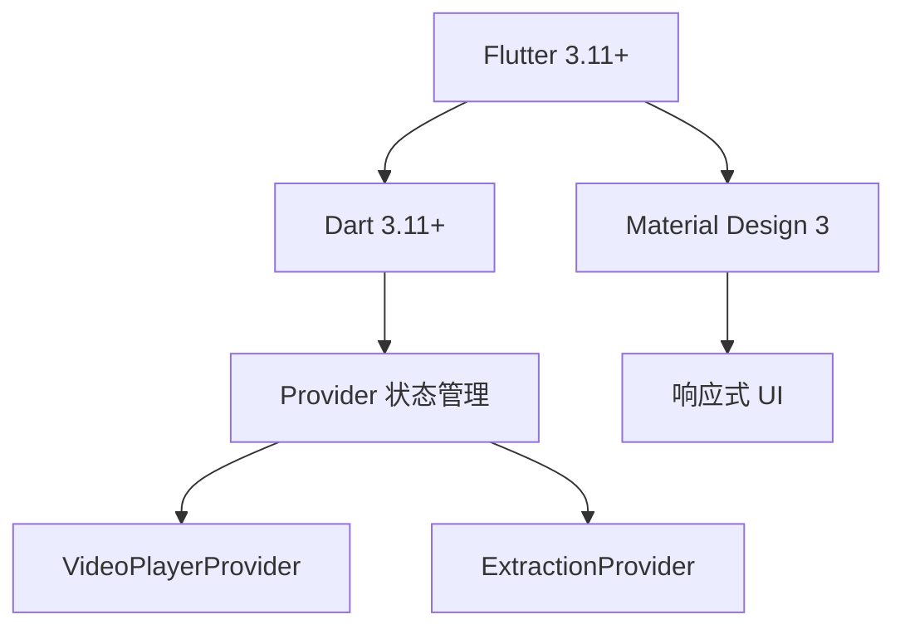

<div align="center">


# 🎵 AudioExtractor

### **专业的视频音频提取工具**

**从视频中轻松提取高质量音频，支持精确时间范围选择和实时预览**

[](https://flutter.dev)
[](https://dart.dev)
[](https://www.apple.com/macos/)
[](LICENSE)
[](https://github.com/binlly/AudioExtractor)
[](https://github.com/binlly/AudioExtractor/issues)

[功能特性](#-功能特性) • [快速开始](#-快速开始) • [使用指南](#-使用指南) • [开发指南](#-开发指南) • [常见问题](#-常见问题)

[English](README_EN.md) • 简体中文

</div>

---

## 📖 项目简介

**AudioExtractor** 是一款使用 Flutter 开发的专业跨平台桌面应用，专注于从视频文件中提取高质量音轨。应用提供了直观的可视化界面，支持精确的时间范围选择、实时视频预览和多音轨处理。

### ✨ 为什么选择 AudioExtractor？

| 特性 | AudioExtractor | 其他工具 |
|------|----------------|----------|
| 🎬 **视频预览** | 内置播放器，可视化选择 | ❌ 通常需要外部播放器 |
| 🎯 **精确控制** | 毫秒级精度 | ⚠️ 秒级或分钟级 |
| 🚀 **开箱即用** | 内置 FFmpeg，无需安装 | ❌ 需要手动配置 FFmpeg |
| 🎨 **现代界面** | Material Design 3 | ⚠️ 界面陈旧 |
| ⌨️ **快捷键** | 完整的键盘支持 | ❌ 缺少快捷键 |
| 🌍 **跨平台** | macOS / Windows / Linux（计划中） | ⚠️ 通常只支持单一平台 |

### 🎯 核心优势

<div align="center">


</div>

- 🎬 **内置视频播放器** - 直接预览视频内容，可视化选择提取范围
- 🎯 **毫秒级精度** - 双滑块进度条 + 手动输入，精确到毫秒
- 🚀 **完全独立** - 基于 `ffmpeg_kit_flutter_new`，内置 FFmpeg 库
- 🎨 **现代化UI** - Material Design 3，流畅的动画效果
- ⌨️ **快捷键支持** - 完整的键盘快捷键系统
- 🔧 **高级设置** - 支持自定义 FFmpeg 参数
- ✅ **零配置** - 不依赖外部 FFmpeg 安装，开箱即用

---

## 🎉 功能特性

### 🆕 最新功能 (v2.5+)

#### 📹 视频预览播放器
- ✅ 内置视频播放器，支持拖拽加载
- ✅ 可视化双滑块时间范围选择
- ✅ 实时预览选中片段（低分辨率流畅预览）
- ✅ 平滑的颜色渐变动画效果
- ✅ 自动恢复播放状态
- ✅ 替换视频时显示确认对话框

#### ⌨️ 键盘快捷键系统
| 快捷键 | 功能 |
|--------|------|
| `空格` | 播放/暂停视频 |
| `←` / `→` | 快退/快进 5秒 |
| `Shift + ←` / `Shift + →` | 单帧后退/前进 |
| `R` | 从头开始播放 |

#### 🎨 UI 优化
- ✅ 质量选择器和输出目录改为下拉菜单
- ✅ 高级设置面板（支持自定义 FFmpeg 参数）
- ✅ 智能文件命名（包含时间范围信息）
- ✅ 实时进度显示和预计剩余时间
- ✅ 点击占位符选择文件（无需拖拽）

### 🔧 核心功能

#### 📁 文件处理
- **拖拽支持** - 直接拖拽视频文件到应用窗口
- **点击选择** - 点击占位符打开文件选择对话框
- **替换提示** - 拖动新视频时显示确认对话框
- **多音轨识别** - 自动检测视频中的所有音轨
- **智能命名** - 输出文件名自动包含时间范围信息
- **中文支持** - 完美支持中文文件名和路径

#### 🎵 音频提取
- **时间范围选择** - 精确选择要提取的音频片段
  - 毫秒级精度（短视频）
  - 秒级精度（长视频）
  - 实时视频预览
- **质量预设** - 三种质量预设
  - 🎯 高质量（保持原始质量）
  - ⚖️ 标准（192kbps AAC）
  - 📦 压缩（128kbps AAC）
- **多音轨保留** - 提取时保留多个音轨结构
- **自定义参数** - 高级用户可自定义 FFmpeg 参数

#### 📊 用户体验
- **实时进度** - 显示提取进度和预计剩余时间
- **音轨预览** - 选择性提取需要的音轨
- **输出目录** - 自定义输出位置
- **错误处理** - 详细的错误提示和解决建议

---

## 🛠️ 技术栈

### 前端框架
<div align="center">



</div>

- **Flutter** 3.11.1+ - 跨平台UI框架
- **Dart** 3.11.1+ - 编程语言
- **Material Design 3** - UI 设计语言

### 状态管理
- **Provider** 6.1.1+ - 状态管理解决方案
  - `VideoPlayerProvider` - 视频播放状态
  - `ExtractionProvider` - 提取任务状态

### 多媒体处理
- **video_player** 2.11.1+ - 视频播放
- **ffmpeg_kit_flutter_new** 2.0.0 - 音视频处理引擎（内置 FFmpeg）
  - 音频提取
  - 格式转换
  - 质量调整
  - **完全独立，不依赖外部 FFmpeg 安装**

### 桌面功能
- **desktop_drop** 0.7.0+ - 文件拖拽支持
- **file_selector** 1.1.0+ - 文件选择器
- **path_provider** 2.1.5+ - 路径管理

### 项目架构
```
┌─────────────────────────────────────────┐
│            UI Layer (Widgets)           │
│  ┌────────────────────────────────────┐ │
│  │  VideoPlayerWidget                 │ │
│  │  DualSliderProgressBar             │ │
│  │  KeyboardHandler                  │ │
│  └────────────────────────────────────┘ │
└──────────────┬──────────────────────────┘
               │
┌──────────────▼──────────────────────────┐
│       Business Logic Layer             │
│  ┌────────────────────────────────────┐ │
│  │  VideoPlayerProvider               │ │
│  │  ExtractionProvider                │ │
│  └────────────────────────────────────┘ │
└──────────────┬──────────────────────────┘
               │
┌──────────────▼──────────────────────────┐
│         Service Layer                   │
│  ┌────────────────────────────────────┐ │
│  │  FFmpegKitService                  │ │
│  │  VideoAnalyzer                     │ │
│  │  AudioExtractor                    │ │
│  └────────────────────────────────────┘ │
└──────────────┬──────────────────────────┘
               │
┌──────────────▼──────────────────────────┐
│          Data Layer                     │
│  ┌────────────────────────────────────┐ │
│  │  AudioTrack                        │ │
│  │  ExtractionSettings                │ │
│  │  TimeRange                         │ │
│  └────────────────────────────────────┘ │
└─────────────────────────────────────────┘
```

---

## 🚀 快速开始

### 系统要求

#### ✅ macOS (当前支持)
- macOS 11.0 (Big Sur) 或更高版本
- x86_64 或 arm64 (Apple Silicon) 架构
- 至少 100MB 可用磁盘空间

#### 🔄 Windows (计划中)
- Windows 10 或更高版本
- x86_64 架构

#### 🔄 Linux (计划中)
- 主流 Linux 发行版
- x86_64 架构

### 📦 安装方式

#### 方式一：从 GitHub Releases 下载（推荐）

<div align="center">

```bash
# 1. 前往 Releases 页面
https://github.com/binlly/AudioExtractor/releases

# 2. 下载对应平台的安装包
macOS: AudioExtractor-v2.5.1-macos.dmg

# 3. 安装并运行
双击 .dmg 文件 → 拖拽到 Applications 文件夹
```

</div>

#### 方式二：从源码构建

<div align="center">

```bash
# 1. 克隆仓库
git clone https://github.com/binlly/AudioExtractor.git
cd AudioExtractor

# 2. 安装依赖
flutter pub get

# 3. 运行应用（开发模式）
flutter run -d macos

# 4. 构建应用（发布模式）
flutter build macos --release

# 构建产物位置
# build/macos/Build/Products/Release/AudioExtractor.app
```

</div>

### 🔨 构建产物

构建完成后，应用位于：
```
build/macos/Build/Products/Release/AudioExtractor.app
```

**文件大小**：约 99MB（包含内置 FFmpeg）

---

## 📖 使用指南

### 🎬 基础工作流程

<div align="center">


</div>

#### 1️⃣ 加载视频
- **拖拽加载**：直接拖拽视频文件到应用窗口
- **点击选择**：点击界面打开文件选择对话框
- **支持格式**：MP4, MKV, AVI, MOV, WMV, FLV 等
- **特殊字符**：完美支持中文文件名和路径

#### 2️⃣ 预览和选择
- 使用内置播放器预览视频
- 拖动双滑块选择时间范围
  - 左滑块：开始时间
  - 右滑块：结束时间
- 或手动输入精确时间（HH:MM:SS.mmm）
- 实时预览选中片段

#### 3️⃣ 配置输出
- 选择要提取的音轨
- 选择质量预设（高质量/标准/压缩）
- 设置输出目录
- （可选）自定义 FFmpeg 参数

#### 4️⃣ 开始提取
- 点击"开始提取"按钮
- 等待进度完成
- 自动打开输出目录

### ⚙️ 高级功能

#### 🎯 自定义 FFmpeg 参数

<div align="center">

```bash
# 1. 点击"高级设置"展开面板
# 2. 选择质量预设作为基础
# 3. 在"自定义参数"中添加额外的 FFmpeg 选项
# 4. 查看实时命令预览

# 示例：提高音频质量
自定义参数: -b:a 320k

# 示例：调整采样率
自定义参数: -ar 48000

# 示例：使用特定编码器
自定义参数: -c:a libmp3lame
```

</div>

#### ⌨️ 键盘快捷键

<div align="center">

| 快捷键 | 功能 | 说明 |
|--------|------|------|
| `空格` | 播放/暂停 | 切换视频播放状态 |
| `←` | 快退 5 秒 | 快速向后跳转 |
| `→` | 快进 5 秒 | 快速向前跳转 |
| `Shift + ←` | 单帧后退 | 精确控制，后退一帧 |
| `Shift + →` | 单帧前进 | 精确控制，前进一帧 |
| `R` | 从头播放 | 跳转到视频开头 |
| `Esc` | 关闭设置 | 关闭高级设置面板 |

</div>

### 📝 使用技巧

1. **精确选择**：使用单帧前进/后退功能精确选择起始点
2. **批量处理**：可以依次处理多个视频，每个视频独立配置
3. **质量选择**：
   - 音乐推荐：高质量
   - 语音推荐：标准
   - 节省空间：压缩
4. **文件命名**：输出文件名自动包含时间范围，便于管理

---

## 🔧 开发指南

### 🛠️ 环境设置

#### 1. 安装 Flutter SDK

<div align="center">

```bash
# 下载 Flutter SDK
git clone https://github.com/flutter/flutter.git
export PATH="$PATH:`pwd`/flutter/bin"

# 验证安装
flutter doctor

# 预期输出：
# Flutter: ✅
# Dart: ✅
# macOS: ✅
```

</div>

#### 2. 克隆项目

<div align="center">

```bash
git clone https://github.com/binlly/AudioExtractor.git
cd AudioExtractor
```

</div>

#### 3. 安装依赖

<div align="center">

```bash
flutter pub get
```

</div>

### 📂 项目结构

```
lib/
├── main.dart                          # 应用入口
│
├── models/                            # 数据模型
│   ├── audio_track.dart               # 音轨模型
│   ├── extraction_settings.dart       # 提取配置
│   ├── quality_preset.dart            # 质量预设
│   └── time_range.dart                # 时间范围
│
├── providers/                         # 状态管理
│   ├── extraction_provider.dart       # 提取任务状态
│   └── video_player_provider.dart     # 视频播放状态
│
├── services/                          # 业务服务
│   ├── ffmpeg_kit_service.dart        # FFmpeg Kit 封装（内置库）
│   ├── video_analyzer.dart            # 视频分析
│   ├── audio_extractor.dart           # 音频提取
│   ├── output_manager.dart            # 输出文件管理
│   └── file_utils.dart                # 文件工具
│
├── ui/
│   ├── pages/
│   │   └── home_page.dart             # 主页面
│   └── widgets/
│       ├── video_player_widget.dart   # 视频播放器
│       ├── dual_slider_progress_bar.dart  # 双滑块
│       ├── keyboard_handler.dart      # 键盘处理
│       └── ...                        # 其他组件
│
└── utils/                             # 工具函数
    ├── logger.dart                    # 日志工具
    └── helpers.dart                   # 辅助函数
```

### 💻 开发命令

<div align="center">

```bash
# 运行开发版本
flutter run

# 热重载（应用运行时按 `r`）
# 热重启（应用运行时按 `R`）

# 运行测试
flutter test

# 分析代码
flutter analyze

# 格式化代码
dart format .

# 构建发布版本
flutter build macos --release

# 运行特定测试
flutter test test/widget_test.dart
```

</div>

### 📋 代码规范

- ✅ 遵循 [Flutter 风格指南](https://flutter.dev/docs/development/data-and-backend/code-style)
- ✅ 使用 `dart format` 格式化代码
- ✅ 运行 `flutter analyze` 确保无警告
- ✅ 为公共 API 添加文档注释
- ✅ 使用有意义的变量和函数名
- ✅ 遵循 SOLID 原则
- ✅ 编写单元测试和集成测试

### 🧪 测试

<div align="center">

```bash
# 运行所有测试
flutter test

# 运行特定测试文件
flutter test test/video_player_test.dart

# 生成测试覆盖率报告
flutter test --coverage

# 查看覆盖率报告
genhtml coverage/lcov.info -o coverage/html
open coverage/html/index.html
```

</div>

---

## 🤝 贡献指南

我们欢迎所有形式的贡献！🎉

### 如何贡献

<div align="center">


</div>

1. **Fork** 本仓库
2. 创建特性分支 (`git checkout -b feature/AmazingFeature`)
3. 提交更改 (`git commit -m 'Add some AmazingFeature'`)
4. 推送到分支 (`git push origin feature/AmazingFeature`)
5. 开启 **Pull Request**

### 🎯 贡献类型

- 🐛 **修复 Bug** - 修复已知问题
- ✨ **新功能** - 添加新特性
- 📝 **文档** - 改进文档
- 🎨 **UI/UX** - 改进用户界面
- ⚡ **性能** - 性能优化
- 🧪 **测试** - 添加或改进测试

### 📖 开发指南

请阅读 [CONTRIBUTING.md](CONTRIBUTING.md) 了解详细的贡献指南。

---

## 📅 开发路线图

### 🎯 v2.6 (计划中)

- [ ] 改进错误处理和用户反馈
- [ ] 添加批量处理功能
- [ ] 支持更多输出格式 (AAC, FLAC, OGG)
- [ ] 添加音频预览功能
- [ ] 优化大文件处理性能

### 🌍 v3.0 - 跨平台支持 (计划中)

#### Windows 支持
- [ ] 移植到 Windows 平台
- [ ] 适配 Windows 文件系统
- [ ] Windows 安装包 (MSI)
- [ ] Windows 特定优化

#### Linux 支持
- [ ] 移植到 Linux 平台
- [ ] 支持 deb/rpm 安装包
- [ ] AppImage 支持
- [ ] 不同发行版适配

### 🚀 未来计划

- [ ] 🌐 **Web 版本**（使用 Flutter Web）
- [ ] 📱 **移动版本**（iOS/Android）
- [ ] 🎵 **音频编辑功能**（剪切、合并、混音）
- [ ] 🔄 **批量转换**（处理整个文件夹）
- [ ] 📊 **输出历史记录**（记录所有提取任务）
- [ ] 🎨 **主题自定义**（深色模式、自定义颜色）
- [ ] 🌍 **多语言支持**（英文、中文、日文等）

---

## ❓ 常见问题

### 🐛 提取失败怎么办？

#### 问题 1：退出码为 null
- ✅ **已修复** - 使用 `executeWithArguments()` 替代 `execute()`
- **解决方案**：确保使用最新版本

#### 问题 2：路径包含中文字符
- ✅ **已修复** - FFmpeg Kit 会自动处理中文路径
- **无需特殊配置**

#### 问题 3：输出目录不可写
- ✅ **已修复** - 路径初始化失败时使用正确的主目录路径
- **检查点**：
  - 输出目录是否存在
  - 是否有写入权限
  - 磁盘空间是否充足

### 💥 双击运行崩溃？

**问题**：Release 版本双击运行时崩溃
- ✅ **已修复** - 使用内置 FFmpeg Kit，不依赖外部安装
- **不再需要**：系统安装 FFmpeg

### 🎬 视频解析失败？

**问题**：获取不到音轨信息
- ✅ **已修复** - 使用 `jsonEncode()` 而不是 `toString()`
- **检查点**：
  - 视频文件是否损坏
  - 是否包含音频流
  - 文件格式是否支持

### 🆘 如何获取帮助？

1. **查看文档**：
   - [TECHNICAL_NOTES.md](TECHNICAL_NOTES.md) - 技术实现细节
   - [CHANGELOG.md](CHANGELOG.md) - 版本历史
   - [DEBUGGING_GUIDE.md](DEBUGGING_GUIDE.md) - 调试指南

2. **搜索 Issues**：
   - [GitHub Issues](https://github.com/binlly/AudioExtractor/issues)

3. **提问**：
   - 创建新的 [Issue](https://github.com/binlly/AudioExtractor/issues/new)
   - 描述问题时请提供：
     - macOS 版本
     - 应用版本
     - 错误信息
     - 复现步骤

---

## 📄 许可证

<div align="center">

```
MIT License

Copyright (c) 2026 AudioExtractor

Permission is hereby granted, free of charge, to any person obtaining a copy
of this software and associated documentation files (the "Software"), to deal
in the Software without restriction, including without limitation the rights
to use, copy, modify, merge, publish, distribute, sublicense, and/or sell
copies of the Software, and to permit persons to whom the Software is
furnished to do so, subject to the following conditions:

The above copyright notice and this permission notice shall be included in all
copies or substantial portions of the Software.

THE SOFTWARE IS PROVIDED "AS IS", WITHOUT WARRANTY OF ANY KIND, EXPRESS OR
IMPLIED, INCLUDING BUT NOT LIMITED TO THE WARRANTIES OF MERCHANTABILITY,
FITNESS FOR A PARTICULAR PURPOSE AND NONINFRINGEMENT. IN NO EVENT SHALL THE
AUTHORS OR COPYRIGHT HOLDERS BE LIABLE FOR ANY CLAIM, DAMAGES OR OTHER
LIABILITY, WHETHER IN AN ACTION OF CONTRACT, TORT OR OTHERWISE, ARISING FROM,
OUT OF OR IN CONNECTION WITH THE SOFTWARE OR THE USE OR OTHER DEALINGS IN THE
SOFTWARE.
```

</div>

---

## 🙏 致谢

### 📦 使用的开源项目

<div align="center">

| 项目 | 用途 | 许可证 |
|------|------|--------|
| [Flutter](https://flutter.dev) | UI 框架 | BSD-3 |
| [FFmpeg](https://ffmpeg.org) | 音视频处理 | GPL-2.1 |
| [ffmpeg-kit](https://github.com/arthenica/ffmpeg-kit) | FFmpeg Flutter 集成 | GPL-3.0 |
| [video_player](https://pub.dev/packages/video_player) | 视频播放 | BSD-3 |
| [provider](https://pub.dev/packages/provider) | 状态管理 | MIT |
| [desktop_drop](https://pub.dev/packages/desktop_drop) | 文件拖拽 | MIT |
| [file_selector](https://pub.dev/packages/file_selector) | 文件选择 | MIT |

</div>

### 🌟 特别感谢

- **Flutter 团队** - 提供优秀的跨平台框架
- **FFmpeg 团队** - 提供强大的音视频处理工具
- **所有贡献者** - 感谢你们的支持和反馈
- **开源社区** - 感谢所有开源项目的维护者

---

## 📮 联系方式

<div align="center">

### 🌐 社交媒体

- **GitHub**: [https://github.com/binlly](https://github.com/binlly)
- **Issues**: [https://github.com/binlly/AudioExtractor/issues](https://github.com/binlly/AudioExtractor/issues)
- **Discussions**: [https://github.com/binlly/AudioExtractor/discussions](https://github.com/binlly/AudioExtractor/discussions)

### 📧 联系方式

- **Email**: [通过 GitHub 联系](https://github.com/binlly)
- **问题反馈**: [创建 Issue](https://github.com/binlly/AudioExtractor/issues/new)

</div>

---

## 🌟 Star History

如果这个项目对你有帮助，请给一个 ⭐️ Star！

<div align="center">

[](https://star-history.com/#binlly/AudioExtractor&Date)

</div>

---

<div align="center">

### 🎉 现在就开始使用吧！

[下载最新版本](https://github.com/binlly/AudioExtractor/releases/latest) • [查看文档](TECHNICAL_NOTES.md) • [报告问题](https://github.com/binlly/AudioExtractor/issues)

---

**Made with ❤️ by [binlly](https://github.com/binlly)**

[⬆ 返回顶部](#-audioextractor)

</div>
